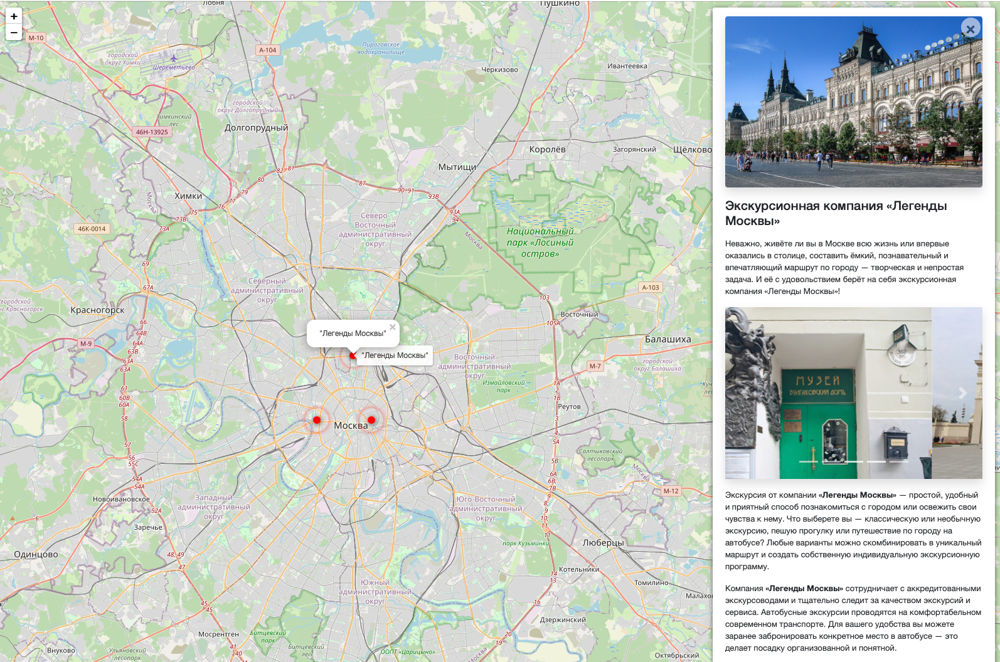
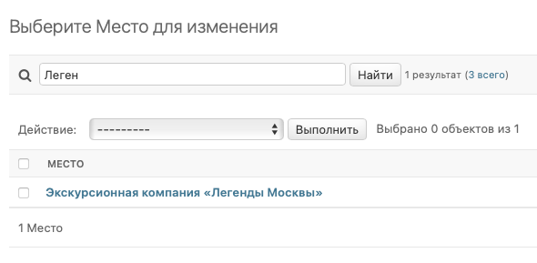
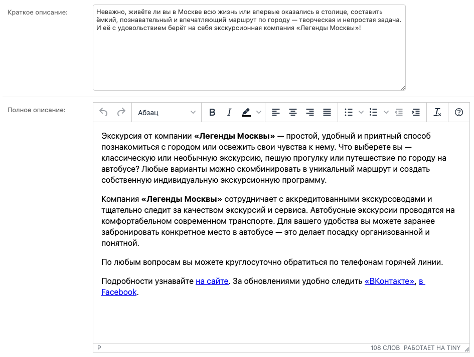
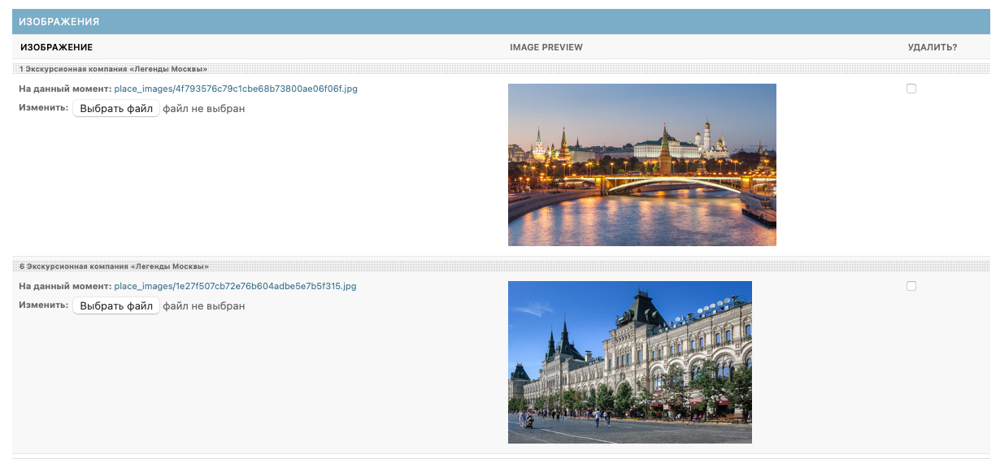
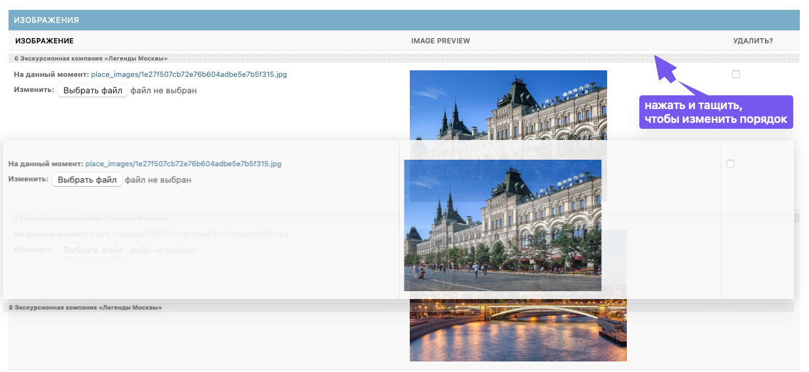
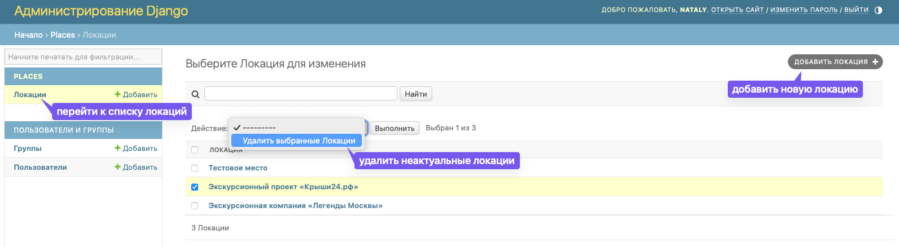

# Интерактивная карта Москвы

Этот проект представляет собой интерактивную карту Москвы, на которой пользователи могут просматривать различные виды
активного отдыха с подробными описаниями и комментариями. 


Возможные активности добавляются администратором вручную через удобный интерфейс.

## Установка при развертывании проекта локально

Для установки проекта, выполните следующие шаги:

1. Склонируйте репозиторий:
```bash
git clone https://github.com/ваш-пользователь/ваш-репозиторий.git
```
2. Создайте виртуальное окружение и активируйте его:
```bash
python -m venv env
source env/bin/activate
```
Работоспособность проекта протестирована на python 3.10 и python 3.11

3. Установите зависимости:
```bash
pip install -r requirements.txt
```
4. Примените миграции:
```bash
python manage.py migrate
```
5. Заполните базу данных тестовыми данными:
```
python manage.py load_place <http://адрес/файла.json>
```
Данные для локаций можно взять по [ссылке](https://github.com/devmanorg/where-to-go-places). 
Следуйте инструкции для получения адресов для последующего скачивания.
6. Создайте файл .env и заполните в нем следующие переменные:
```
SECRET_KEY=<YOUR SECRET KEY>
ALLOWED_HOSTS=127.0.0.1
DEBUG=True
```
**SECRET_KEY** - Секретный ключ для конкретной установки Django. Он используется для обеспечения cryptographic signing,
и должен быть установлен на уникальное, непредсказуемое значение. Сгенерировать SECRET_KEY можно по
[ссылке](https://djecrety.ir/).

**ALLOWED_HOSTS** - Список строк, представляющих имена хостов/доменов, которые может обслуживать данный Django-сайт. Подробнее можно почитать по
[ссылке](https://django.fun/ru/docs/django/4.0/ref/settings/#allowed-hosts).

**DEBUG** - Булево значение, которое включает/выключает режим отладки. 
Подробнее по [ссылке](https://django.fun/ru/docs/django/4.0/ref/settings/#debug).

## Использование

### Если Вы развернули проект локально

Запустите сервер разработки:
```bash
python manage.py runserver
```
Откройте браузер и перейдите по адресу http://localhost:8000/ для просмотра интерактивной карты Москвы.
Чтобы добавить или изменить локации, 
Вам необходимо перейти в интерфейс администратора по ссылке: http://localhost:8000/admin.

Перед импользованием интерфейса администратора нужно создать суперпользователя. Для этого выполните команду:
```bash
python manage.py createsuperuser
```
Вас попросят ввести имя пользователя, адрес электронной почты и пароль для нового суперпользователя.
Запомните эти данные, так как они понадобятся для входа в админку.

### Если Вы хотите использовать опубликованную версию

Перейдите по [ссылке](https://kashseva.pythonanywhere.com/), чтобы посмотреть, как работает интерактивная карта.
Чтобы добавить или изменить локации, Вам необходимо перейти в интерфейс администратора по [ссылке](https://kashseva.pythonanywhere.com/admin).

**Чтобы использовать интерфейс администратора в опубликованной версии у Вас должен быть логин и пароль для входа.**

**Интерфейс администратора позволяет:**

1. Просмотреть список локаций и найти локацию по названию (поиск чувствителен к регистру).
    
2. Перейти на страницу редактирования локации и для каждой локации:
   - Обновить текстовки
   
   - Залить новые картинки и удалить старые
   
   - Выбрать самые яркие картинки и переместить их в начало списка, чтобы изменить порядок их отображения на сайте.
   
3. Добавить новые локации или удалить старые
   


## Цели проекта

Код написан в учебных целях — это урок в курсе по Python и веб-разработке на сайте [Devman](https://dvmn.org).

Тестовые данные взяты с сайта [KudaGo](https://kudago.com).
